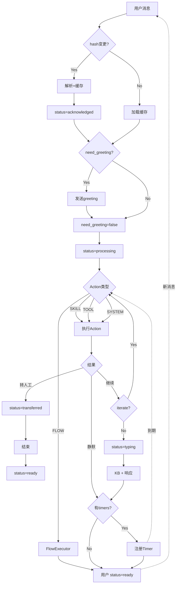

# Workflow Engine 技术方案 v8

## 一、执行流程



## 二、状态设计

```python
@dataclass
class WorkflowState:
    hash: str                      # 配置md5
    need_greeting: bool = True     # 是否需要打招呼
    status: str = "ready"          # 处理阶段
```

| status | 含义 |
|--------|------|
| `acknowledged` | 解析完成 |
| `processing` | 执行中 |
| `typing` | 生成响应 |
| `ready` | 就绪 |
  | `cancelled` | 取消或异常中断 |
| `transferred` | 转人工 |

## 三、Action 统一抽象

所有动作统一为 Action 调用：

```python
@dataclass
class Action:
    type: str      # SKILL | TOOL | FLOW | SYSTEM
    target: str    # action_id / tool_id / flow_id
    params: dict
```

| 类型 | 执行方式 | 响应体现 |
|------|----------|----------|
| **SKILL** | 匹配意图 → 调用API | ✅ |
| **TOOL** | 直接调用 | ✅ |
| **FLOW** | 路由到预注册函数 | ❌ 接管 |
| **SYSTEM** | 静默执行 | ❌ 不参与上下文 |

### 3.1 SYSTEM Action 特性

| 操作 | 意图示例 | 说明 |
|------|----------|------|
| `close_conversation` | "再见" | 关闭会话，静默 |
| `handoff` | "转人工" | 人工转接，需响应提示 |
| `update_profile` | "换号码了" | 更新用户信息，静默 |

**设计原则：**
- 串行执行，模型控制顺序
- 静默 action 不参与上下文，响应不体现
- `handoff` 特殊：先响应再转接
- 由 Prompt 控制，代码只做执行

## 四、核心逻辑

```python
class WorkflowEngine:
    async def process(self, session: Session, msg: str):
        ws = session.workflow_state or WorkflowState(hash="")
        h = compute_hash(self._config)
        
        # 1. 配置检测
        if ws.hash != h:
            plan = await self._planner.plan(session, msg)
            await self._cache.set(session.agent_id, h, plan)
            ws = WorkflowState(hash=h, status="acknowledged")
            await self._save(session, ws)
        else:
            plan = await self._cache.get(session.agent_id, h)
        
        # 2. 打招呼
        if plan.greeting and ws.need_greeting:
            await self._emit(plan.greeting)
            ws.need_greeting = False
            await self._save(session, ws)
        
        # 3. 迭代执行
        ws.status = "processing"
        await self._save(session, ws)
        
        while True:
            decision = await self._iterate(session, plan)
            ws.status = decision.next_status
            await self._save(session, ws)
            
            if ws.status == "transferred":
                # handoff: 先响应，再转接
                if decision.response:
                    await self._emit(decision.response)
                if decision.action:
                    await self._execute(decision.action)
                return
            
            if ws.status == "typing":
                # 正常响应
                await self._emit(decision.response)
                ws.status = "ready"
                break
            
            if ws.status == "ready":
                # 静默完成
                break
            
            # processing: 串行执行单个 action
            if decision.action:
                await self._execute(decision.action)
        
        await self._save(session, ws)
        
        # 4. Timer
        if plan.timers:
            await self._timer.schedule(session.id, plan.timers)
    
    async def _iterate(self, session, plan) -> IterationDecision:
        """模型驱动：判断下一步"""
        return await self._llm.decide(context=session.context, plan=plan)
    
    async def _execute(self, action: Action):
        """统一执行入口 - 串行"""
        match action.type:
            case "SKILL": return await self._skill_executor.execute(action)
            case "TOOL": return await self._tool_executor.execute(action)
            case "FLOW": return await self._flow_registry[action.target](action.params)
            case "SYSTEM": return await self._system_executor.execute(action)

@dataclass
class IterationDecision:
    next_status: str      # processing | typing | ready | transferred
    action: Action | None # 单个 action（串行执行）
    response: str | None  # typing/transferred 时的响应
```

## 五、Executor 实现

### 5.1 SkillExecutor

```python
class SkillExecutor:
    """匹配意图 → 调用API"""
    async def execute(self, action: Action):
        # 意图已匹配，直接调用对应 API
        return await self._api_registry[action.target](action.params)
```

### 5.2 FlowExecutor

```python
class FlowExecutor:
    """固定规则，完全接管"""
    async def execute(self, flow_id: str, params: dict):
        return await self._registry[flow_id](params)
```

### 5.3 SystemExecutor

```python
class SystemExecutor:
    """静默执行，不参与上下文"""
    async def execute(self, action: Action):
        match action.target:
            case "close_conversation": await self._close(action.params)
            case "handoff": await self._transfer(action.params)
            case "update_profile": await self._update_profile(action.params)
```

## 六、Timer

```python
class TimerScheduler:
    async def schedule(self, session_id: str, timers: list):
        await self._cancel_existing(session_id)
        for t in timers:
            await self._queue.enqueue(session_id, t)
    
    async def on_trigger(self, session_id: str, timer):
        await self._engine._execute(timer.action)
```

## 七、配置解析

### 7.1 CachedPlan 结构

```python
@dataclass
class CachedPlan:
    name: str
    tone: str
    greeting: str | None
    sop: str                  # 优化后的 SOP
    tools: list[dict]         # 工具定义
    skills: list[dict]        # action_books
    timers: list[Timer] | None
    constraints: str          # 优化后的约束
```

### 7.2 两阶段流程

```
Phase 1 (配置变更):  config + message → LLM → CachedPlan + Decision → 缓存
Phase 2 (后续会话):  CachedPlan + message → LLM → Decision → 迭代
```

## 八、System Prompts

### 8.1 Phase 1: Parse & First Match

```
You are a configuration parser for an AI agent system.

## Tasks
1. Optimize raw configuration into clean, actionable format
2. Match current user message and determine next action

## Parsing Rules

### SOP Optimization
Rewrite procedure into clear steps:
- Preserve meaning, remove ambiguity
- Make conditions explicit
- Clarify step transitions

### Constraints Optimization
Consolidate rules for reply style, boundaries, data handling.

### Timers
Extract time-based triggers: delay, action, message.

## Input
<config>
{config_json}
</config>

<tools>
{tools_definitions}
</tools>

<skills>
{action_books_with_conditions}
</skills>

<user_message>
{message}
</user_message>

## Status Decision Rules
- `processing`: Need more actions after current one
- `typing`: Ready to respond to user
- `ready`: Silent completion, no response
- `transferred`: Handoff (respond first, then transfer)

## Output
{
  "plan": {
    "name": "...",
    "tone": "...",
    "greeting": "...",
    "sop": "optimized procedure",
    "timers": [...],
    "constraints": "optimized rules"
  },
  "decision": {
    "next_status": "processing|typing|ready|transferred",
    "action": {"type": "SKILL|TOOL|SYSTEM", "target": "...", "params": {}},
    "response": "..."
  }
}
```

### 8.2 Phase 2: Iteration

```
You are an AI agent following a defined SOP.

## Agent
{name} | {tone}

## SOP
{sop}

## Tools
{tools}

## Skills
{skills}

## Constraints
{constraints}

## Conversation
{history}

## User Message
{message}

## Status Decision Rules
| Status | When | Response |
|--------|------|----------|
| `processing` | Need more actions | Optional |
| `typing` | Generate final response | Required |
| `ready` | Silent completion | None |
| `transferred` | Handoff to human | Required |

## Output
{
  "reasoning": "brief analysis",
  "next_status": "processing|typing|ready|transferred",
  "action": {"type": "...", "target": "...", "params": {}},
  "response": "..."
}

## Rules
- One question at a time
- Max 2 sentences
- Never invent facts
- If unclear, ask to clarify
- If still unclear, handoff
```

## 九、数据存储 (MongoDB)

```javascript
// sessions collection - 扩展
workflow_state: {
    hash: "abc123",
    need_greeting: false,
    status: "ready"
}

// plan_cache collection
{
    workflow_id: "xxx",
    hash: "abc123",
    name: "...",
    tone: "...",
    greeting: "...",
    sop: "optimized procedure",
    tools: [...],
    skills: [...],
    timers: [...],
    constraints: "..."
}
```

## 十、状态流转

```
acknowledged → processing → typing → ready
                   ↓         ↓
            transferred    ready (silent)
```

## 十一、实现路径

1. 扩展 Session 添加 `workflow_state`
2. 新增 `plan_cache` collection
3. 实现 `WorkflowEngine`
4. 实现 Executors (Skill/Tool/Flow/System)
5. 实现 `TimerScheduler`
6. 实现 Phase 1 & Phase 2 Prompts