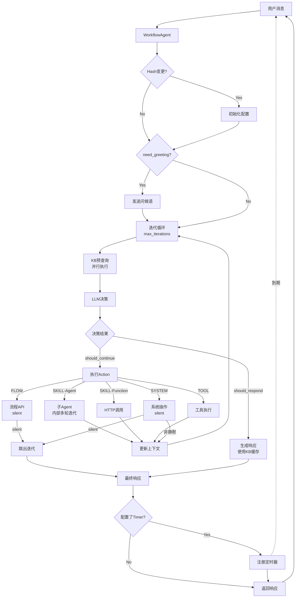

# Workflow Agent 技术方案 v9

> 基于 BU Agent SDK 的配置驱动工作流引擎
>
> **设计原则：** 精简、高效、渐进式、复用现有架构

## 版本更新说明

**v9.2 核心特性：**

1. **SOP驱动的轻量级迭代**
   - ✅ 外层轻量级循环：支持多步骤Action序列执行
   - ✅ LLM智能决策：每步判断是否继续或响应
   - ✅ 可控迭代：限制最大次数，防止无限循环
   - ✅ 清晰职责：外层控制流程，内层处理细节

2. **Silent Action 优化**
   - ✅ Flow/System silent 操作直接跳出迭代
   - ✅ 不参与上下文构建，避免干扰后续决策
   - ✅ 执行后立即完成流程，提升响应速度

3. **KB 并行查询优化**
   - ✅ 迭代开始时预先查询知识库
   - ✅ 不阻塞 LLM 决策，并行执行
   - ✅ 缓存查询结果，需要时直接使用
   - ✅ 显著缩短响应时间

4. **Skills 支持多种执行模式**
   - ✅ Agent 模式：创建子 Agent，内部自行处理多轮工具调用
   - ✅ Function 模式：直接 HTTP 调用外部服务

5. **Flows 极简化设计**
   - ✅ 直接 API 调用，Flow 是黑盒服务
   - ✅ 完全解耦，业务逻辑在后端

6. **静默执行逻辑**
   - ✅ System Action 支持静默模式
   - ✅ 区分静默操作和需响应操作

7. **定时器调度（Timer）**
   - ✅ 基于 asyncio 的异步调度
   - ✅ 自动管理会话级定时器

**核心优势：**
- 更实用：符合实际业务场景（如客服机器人的多步骤流程）
- 更清晰：分层迭代，职责明确
- 更可控：LLM驱动决策 + 迭代次数限制
- 更灵活：支持单次执行和多步骤执行两种模式
- 更高效：Silent Action 跳出迭代 + KB 并行查询

---

## 一、架构设计

### 1.1 核心思想

**v8 → v9 关键变化：**

- ❌ 不引入新的 `WorkflowEngine` 层
- ✅ 扩展现有 `Agent` 类，保持架构一致性
- ✅ 职责分离：配置解析（静态）+ 意图匹配（动态）
- ✅ 两层路由：规则匹配（快速）+ LLM 匹配（智能）

### 1.2 整体架构图



**架构说明：**
- **SOP驱动迭代**：外层轻量级循环，每次由LLM决策下一步
- **分层迭代**：外层控制Action序列，Agent模式Skill内部自行迭代
- **智能决策**：每步判断should_continue（继续执行）或should_respond（生成响应）
- **可控循环**：max_iterations限制，防止无限循环
- **上下文累积**：Skill/Tool结果更新到会话上下文，参与后续决策
- **Silent Action优化**：Flow/System的silent操作执行后直接跳出迭代，不参与上下文构建
- **KB并行查询**：每次迭代开始时预先查询知识库，缓存结果，需要时直接使用
- **Timer异步**：定时器独立触发，不阻塞主流程

### 1.3 模块结构

```
bu_agent_sdk/
├── agent/
│   ├── service.py              # ✅ 现有 Agent 类
│   ├── workflow_agent.py       # NEW: WorkflowAgent
│   └── workflow_state.py       # NEW: 状态管理
│
├── tools/
│   ├── config_loader.py        # ✅ 扩展 AgentConfigSchema
│   ├── action_books.py         # NEW: Skills/Flows 定义
│   └── intent_matcher.py       # NEW: 意图匹配逻辑
│
├── workflow/
│   ├── __init__.py
│   ├── executors.py            # NEW: Skill/Flow/System 执行器
│   ├── cache.py                # NEW: 计划缓存
│   └── scheduler.py            # NEW: Timer 调度器
│
└── examples/
    └── workflow_demo.py        # NEW: 完整示例
```

---

## 二、数据模型

### 2.1 配置 Schema

```python
# bu_agent_sdk/tools/action_books.py

from enum import Enum
from pydantic import BaseModel, Field

class ActionType(str, Enum):
    """动作类型"""
    SKILL = "skill"      # 复杂多步骤任务（子 Agent 或外部服务）
    TOOL = "tool"        # 单一工具调用
    FLOW = "flow"        # 固定流程（API 调用）
    SYSTEM = "system"    # 系统动作（转人工、关闭会话等）

class ActionBookEntry(BaseModel):
    """意图 → 动作映射规则"""
    condition: str = Field(description="触发条件的自然语言描述")
    action_type: ActionType
    action_target: str = Field(description="skill_id | tool_name | flow_id | system_action")
    parameters: dict = Field(default_factory=dict, description="默认参数")
    priority: int = Field(default=0, description="优先级，数字越大越先匹配")

    class Config:
        json_schema_extra = {
            "example": {
                "condition": "用户想写博客文章",
                "action_type": "skill",
                "action_target": "blog_writer",
                "priority": 10
            }
        }

class SkillExecutionMode(str, Enum):
    """技能执行模式"""
    AGENT = "agent"          # 子 Agent 执行（多轮对话）
    FUNCTION = "function"    # 外部函数调用（单次输入输出）

class SkillDefinition(BaseModel):
    """技能定义 - 支持多种执行模式"""
    skill_id: str
    name: str
    description: str

    # 执行模式
    execution_mode: SkillExecutionMode = Field(
        default=SkillExecutionMode.AGENT,
        description="执行模式：agent（子Agent）或 function（外部调用）"
    )

    # Agent 模式配置
    system_prompt: str | None = Field(
        default=None,
        description="系统提示（agent 模式必填）"
    )
    tools: list[str] = Field(
        default_factory=list,
        description="可用工具名称列表（agent 模式）"
    )
    max_iterations: int = Field(
        default=20,
        description="最大迭代次数（agent 模式）"
    )
    require_done_tool: bool = Field(
        default=True,
        description="是否需要显式完成（agent 模式）"
    )

    # Function 模式配置
    endpoint: dict | None = Field(
        default=None,
        description="HTTP 端点配置（function 模式必填）"
    )
    input_schema: dict | None = Field(
        default=None,
        description="输入参数 Schema（function 模式）"
    )
    output_parser: str | None = Field(
        default=None,
        description="输出解析器类型：json | text（function 模式）"
    )

    class Config:
        json_schema_extra = {
            "examples": [
                {
                    "skill_id": "blog_writer",
                    "name": "博客写作助手",
                    "description": "撰写完整的博客文章",
                    "execution_mode": "agent",
                    "system_prompt": "你是专业博客写手，按大纲→正文→润色流程工作",
                    "tools": ["search_kb", "save_draft"],
                    "max_iterations": 20
                },
                {
                    "skill_id": "sentiment_analysis",
                    "name": "情感分析服务",
                    "description": "分析文本情感倾向",
                    "execution_mode": "function",
                    "endpoint": {
                        "url": "http://api.example.com/sentiment",
                        "method": "POST",
                        "body": {"text": "{input}"}
                    },
                    "input_schema": {
                        "type": "object",
                        "properties": {
                            "input": {"type": "string", "description": "待分析文本"}
                        }
                    },
                    "output_parser": "json"
                }
            ]
        }

class FlowDefinition(BaseModel):
    """流程定义 - 直接 API 调用，不关心内部逻辑"""
    flow_id: str
    name: str
    description: str

    # 触发规则
    trigger_patterns: list[str] = Field(
        default_factory=list,
        description="正则表达式列表，用于快速匹配"
    )

    # API 端点配置
    endpoint: dict = Field(
        description="流程执行的 HTTP 端点配置"
    )

    # 参数映射
    parameter_mapping: dict[str, str] = Field(
        default_factory=dict,
        description="参数映射：{api_param: user_message_field}"
    )

    # 响应处理
    response_template: str | None = Field(
        default=None,
        description="响应模板，支持 {result} 占位符"
    )

    class Config:
        json_schema_extra = {
            "example": {
                "flow_id": "leave_request",
                "name": "请假申请",
                "description": "员工请假流程",
                "trigger_patterns": ["我要请假", "申请.*假", "请.*天假"],
                "endpoint": {
                    "url": "http://api.example.com/leave/submit",
                    "method": "POST",
                    "headers": {"Content-Type": "application/json"},
                    "body": {
                        "user_id": "{user_id}",
                        "message": "{user_message}"
                    }
                },
                "parameter_mapping": {
                    "user_message": "raw_input"
                },
                "response_template": "✅ 请假申请已提交\n\n{result}"
            }
        }

class SystemAction(BaseModel):
    """系统动作定义"""
    action_id: str
    name: str
    handler: str = Field(description="处理器类型: handoff | close | update_profile")
    silent: bool = Field(
        default=False,
        description="是否静默执行（不返回响应给用户）"
    )
    response_template: str | None = Field(
        default=None,
        description="响应模板（非静默时使用）"
    )

    class Config:
        json_schema_extra = {
            "examples": [
                {
                    "action_id": "transfer_human",
                    "name": "转人工",
                    "handler": "handoff",
                    "silent": False,
                    "response_template": "正在为您转接人工客服，请稍候..."
                },
                {
                    "action_id": "update_profile",
                    "name": "更新用户信息",
                    "handler": "update_profile",
                    "silent": True
                }
            ]
        }

class TimerConfig(BaseModel):
    """定时器配置"""
    timer_id: str
    delay_seconds: int
    action_type: ActionType
    action_target: str
    message: str | None = Field(default=None, description="定时发送的消息")

@dataclass
class IterationDecision:
    """迭代决策结果 - LLM驱动的决策"""
    should_continue: bool = Field(
        description="是否继续执行下一个Action"
    )
    should_respond: bool = Field(
        description="是否生成最终响应给用户"
    )
    next_action: dict | None = Field(
        default=None,
        description="下一个要执行的Action: {type, target, params}"
    )
    reasoning: str = Field(
        description="决策理由（用于调试和日志）"
    )

    class Config:
        json_schema_extra = {
            "example": {
                "should_continue": True,
                "should_respond": False,
                "next_action": {
                    "type": "tool",
                    "target": "save_customer_information",
                    "params": {"email": "user@example.com"}
                },
                "reasoning": "User provided email, need to save it first"
            }
        }

class WorkflowConfigSchema(BaseModel):
    """完整的工作流配置 Schema"""

    # 基础设置
    basic_settings: dict = Field(
        description="名称、语言、语气等基础配置",
        default_factory=dict
    )

    # 工具定义（HTTP API）
    tools: list[dict] = Field(
        default_factory=list,
        description="HTTP 工具配置列表（复用 ConfigToolLoader）"
    )

    # 技能定义
    skills: list[SkillDefinition] = Field(
        default_factory=list,
        description="复杂多步骤技能列表"
    )

    # 流程定义
    flows: list[FlowDefinition] = Field(
        default_factory=list,
        description="固定流程定义列表"
    )

    # 系统动作
    system_actions: list[SystemAction] = Field(
        default_factory=list,
        description="系统级动作（转人工、关闭等）"
    )

    # 意图映射规则
    action_books: list[ActionBookEntry] = Field(
        default_factory=list,
        description="意图匹配规则列表"
    )

    # 定时器
    timers: list[TimerConfig] = Field(
        default_factory=list,
        description="定时任务配置"
    )

    # 问候语
    greeting: str | None = Field(
        default=None,
        description="首次对话时的问候语"
    )

    # SOP（可选）
    sop: str | None = Field(
        default=None,
        description="标准操作流程描述"
    )

    # 约束条件（可选）
    constraints: str | None = Field(
        default=None,
        description="对话约束和边界规则"
    )

    # 知识库配置（可选）
    kb_config: dict | None = Field(
        default=None,
        description="知识库配置：启用KB增强、KB工具名称等"
    )

    # 迭代控制配置
    max_iterations: int = Field(
        default=5,
        description="最大迭代次数（防止无限循环）"
    )

    iteration_strategy: str = Field(
        default="sop_driven",
        description="迭代策略：sop_driven（SOP驱动多步骤）| single_shot（单次执行）"
    )

    class Config:
        json_schema_extra = {
            "example": {
                "kb_config": {
                    "enabled": True,
                    "tool_name": "search_kb",
                    "auto_enhance": True,
                    "enhance_conditions": ["skill", "tool"]
                },
                "max_iterations": 5,
                "iteration_strategy": "sop_driven"
            }
        }
```

### 2.2 会话状态

```python
# bu_agent_sdk/agent/workflow_state.py

from dataclasses import dataclass, field
from datetime import datetime

@dataclass
class WorkflowState:
    """会话级工作流状态"""

    # 配置版本控制
    config_hash: str = ""
    """配置的 MD5 哈希，用于检测变更"""

    # 生命周期状态
    need_greeting: bool = True
    """是否需要发送问候语"""

    status: str = "ready"
    """
    当前状态：
    - ready: 就绪，等待用户输入
    - processing: 处理中
    - typing: 生成响应中
    - transferred: 已转人工
    - closed: 会话已关闭
    """

    # 扩展字段
    metadata: dict = field(default_factory=dict)
    """自定义扩展字段"""

    last_updated: datetime = field(default_factory=datetime.utcnow)
    """最后更新时间"""

@dataclass
class Session:
    """会话数据"""
    session_id: str
    agent_id: str
    workflow_state: WorkflowState
    messages: list = field(default_factory=list)
    """消息历史"""
```

### 2.3 计划缓存

```python
# bu_agent_sdk/workflow/cache.py

from pydantic import BaseModel
from typing import Protocol
import hashlib
import json
from datetime import datetime

class CachedPlan(BaseModel):
    """缓存的执行计划"""

    workflow_id: str
    config_hash: str

    # 优化后的配置（可选）
    optimized_sop: str | None = None
    optimized_constraints: str | None = None

    # 索引数据（加速查找）
    tool_names: list[str]
    skill_ids: list[str]
    flow_ids: list[str]

    # 元数据
    created_at: datetime
    expires_at: datetime | None = None

class PlanCache(Protocol):
    """计划缓存接口"""

    async def get(self, workflow_id: str, config_hash: str) -> CachedPlan | None:
        """获取缓存的计划"""
        ...

    async def set(self, plan: CachedPlan) -> None:
        """保存计划到缓存"""
        ...

    async def delete(self, workflow_id: str, config_hash: str) -> None:
        """删除缓存"""
        ...

    async def clear_all(self, workflow_id: str) -> None:
        """清除某个 workflow 的所有缓存"""
        ...

class MemoryPlanCache:
    """内存实现（开发和测试用）"""

    def __init__(self):
        self._cache: dict[str, CachedPlan] = {}

    def _make_key(self, workflow_id: str, config_hash: str) -> str:
        return f"{workflow_id}:{config_hash}"

    async def get(self, workflow_id: str, config_hash: str) -> CachedPlan | None:
        key = self._make_key(workflow_id, config_hash)
        plan = self._cache.get(key)

        # 检查过期
        if plan and plan.expires_at and plan.expires_at < datetime.utcnow():
            await self.delete(workflow_id, config_hash)
            return None

        return plan

    async def set(self, plan: CachedPlan) -> None:
        key = self._make_key(plan.workflow_id, plan.config_hash)
        self._cache[key] = plan

    async def delete(self, workflow_id: str, config_hash: str) -> None:
        key = self._make_key(workflow_id, config_hash)
        self._cache.pop(key, None)

    async def clear_all(self, workflow_id: str) -> None:
        keys_to_delete = [k for k in self._cache if k.startswith(f"{workflow_id}:")]
        for key in keys_to_delete:
            self._cache.pop(key)

def compute_config_hash(config: WorkflowConfigSchema) -> str:
    """计算配置的哈希值"""
    # 将配置序列化为稳定的 JSON（排序 key）
    config_json = config.model_dump_json(exclude_none=True, sort_keys=True)
    return hashlib.md5(config_json.encode()).hexdigest()
```

---

## 三、核心组件实现

### 3.1 意图匹配器

```python
# bu_agent_sdk/tools/intent_matcher.py

import re
from dataclasses import dataclass
from typing import Any
from bu_agent_sdk.llm.base import BaseChatModel
from bu_agent_sdk.llm.messages import UserMessage, SystemMessage
from bu_agent_sdk.tools.action_books import (
    ActionType,
    WorkflowConfigSchema,
    FlowDefinition,
)

@dataclass
class IntentMatchResult:
    """意图匹配结果"""
    matched: bool
    action_type: ActionType | None
    action_target: str | None
    parameters: dict
    confidence: float
    reasoning: str | None = None

class IntentMatcher:
    """
    意图匹配器 - 混合策略

    策略：
    1. 规则匹配（Flows 的正则模式） - 快速、精确
    2. LLM 匹配（Skills/Tools/Message） - 灵活、智能
    """

    def __init__(self, config: WorkflowConfigSchema, llm: BaseChatModel):
        self.config = config
        self.llm = llm
        self._compile_rules()

    def _compile_rules(self):
        """预编译正则规则"""
        self.flow_patterns: list[tuple[re.Pattern, FlowDefinition]] = []

        for flow in self.config.flows:
            for pattern in flow.trigger_patterns:
                try:
                    compiled = re.compile(pattern, re.IGNORECASE)
                    self.flow_patterns.append((compiled, flow))
                except re.error as e:
                    # 记录错误但不中断
                    print(f"⚠️  Invalid regex pattern '{pattern}': {e}")

    async def match(
        self,
        user_message: str,
        context: list[Any] | None = None
    ) -> IntentMatchResult:
        """
        匹配用户意图

        流程：
        1. 规则匹配 Flows（高优先级、确定性）
        2. LLM 匹配 Skills/Tools（灵活性）
        3. 默认为 Message（兜底）
        """

        # Phase 1: 规则匹配 Flows
        for pattern, flow in self.flow_patterns:
            if pattern.search(user_message):
                return IntentMatchResult(
                    matched=True,
                    action_type=ActionType.FLOW,
                    action_target=flow.flow_id,
                    parameters={},
                    confidence=1.0,
                    reasoning=f"Pattern matched: {pattern.pattern}"
                )

        # Phase 2: LLM 匹配
        return await self._llm_match(user_message, context or [])

    async def _llm_match(
        self,
        message: str,
        context: list[Any]
    ) -> IntentMatchResult:
        """使用 LLM 进行意图匹配"""

        # 构建 prompt
        system_prompt = self._build_matching_prompt()

        # 构建消息（包含历史上下文）
        messages = [SystemMessage(content=system_prompt)]

        # 添加对话历史（最近 N 条）
        if context:
            recent_context = context[-5:]  # 只保留最近 5 轮
            messages.extend(recent_context)

        messages.append(UserMessage(content=message))

        # 调用 LLM（使用 JSON mode）
        response = await self.llm.ainvoke(
            messages=messages,
            tools=None,
            response_format={"type": "json_object"}
        )

        # 解析结果
        try:
            import json
            result = json.loads(response.content or "{}")

            return IntentMatchResult(
                matched=result.get("matched", True),
                action_type=ActionType(result.get("action_type", "tool")),
                action_target=result.get("action_target", ""),
                parameters=result.get("parameters", {}),
                confidence=result.get("confidence", 0.5),
                reasoning=result.get("reasoning")
            )
        except Exception as e:
            # 解析失败，返回默认
            return IntentMatchResult(
                matched=False,
                action_type=None,
                action_target=None,
                parameters={},
                confidence=0.0,
                reasoning=f"Parse error: {e}"
            )

    def _build_matching_prompt(self) -> str:
        """构建意图匹配的 system prompt"""

        # 列出可用的 Skills
        skills_list = "\n".join([
            f"  - {s.skill_id}: {s.description}"
            for s in self.config.skills
        ])

        # 列出可用的 Tools
        tools_list = "\n".join([
            f"  - {t['name']}: {t.get('description', '')}"
            for t in self.config.tools
        ])

        # 列出 Action Books
        action_books_list = "\n".join([
            f"  {i+1}. {ab.condition} → {ab.action_type}:{ab.action_target}"
            for i, ab in enumerate(self.config.action_books)
        ])

        prompt = f"""You are an intent matcher for a workflow agent.

## Available Resources

### Skills (Complex multi-step tasks)
{skills_list or "  (none)"}

### Tools (Single function calls)
{tools_list or "  (none)"}

### Action Rules
{action_books_list or "  (none)"}

## Your Task

Analyze the user's message and determine:
1. Which action type is most appropriate: skill, tool, or message
2. Which specific skill/tool to call (if applicable)
3. What parameters to pass

## Output Format (JSON)

{{
  "matched": true,
  "action_type": "skill" | "tool" | "message",
  "action_target": "skill_id or tool_name (empty if message)",
  "parameters": {{}},
  "confidence": 0.0-1.0,
  "reasoning": "Brief explanation"
}}

## Rules

- If user needs a complex multi-step task → use "skill"
- If user needs a simple single function → use "tool"
- If user is just chatting or asking questions → use "message" (action_target="")
- Always output valid JSON
"""
        return prompt
```

### 3.2 WorkflowAgent 主类

```python
# bu_agent_sdk/agent/workflow_agent.py

from typing import Any
from bu_agent_sdk import Agent, tool
from bu_agent_sdk.llm.base import BaseChatModel
from bu_agent_sdk.tools.config_loader import ConfigToolLoader
from bu_agent_sdk.tools.action_books import WorkflowConfigSchema
from bu_agent_sdk.tools.intent_matcher import IntentMatcher
from bu_agent_sdk.agent.workflow_state import WorkflowState, Session
from bu_agent_sdk.workflow.cache import PlanCache, MemoryPlanCache, compute_config_hash
from bu_agent_sdk.workflow.executors import (
    SkillExecutor,
    FlowExecutor,
    SystemExecutor,
)

class WorkflowAgent:
    """
    配置驱动的工作流 Agent

    核心职责：
    1. 加载和解析配置
    2. 意图匹配和路由
    3. 动态创建子 Agent（Skills）
    4. 状态管理（greeting、hash 检测、flow 状态）
    5. 执行器协调（Skill/Flow/System）

    使用示例：
        ```python
        config = WorkflowConfigSchema.parse_file("config.json")
        agent = WorkflowAgent(
            config=config,
            llm=ChatOpenAI(model="gpt-4o"),
        )

        response = await agent.query(
            message="帮我写一篇博客",
            session_id="session_123"
        )
        ```
    """

    def __init__(
        self,
        config: WorkflowConfigSchema,
        llm: BaseChatModel,
        plan_cache: PlanCache | None = None,
        session_store: Any | None = None,
    ):
        self.config = config
        self.llm = llm
        self.plan_cache = plan_cache or MemoryPlanCache()
        self.session_store = session_store  # 可选的持久化存储

        # 计算配置 hash
        self.config_hash = compute_config_hash(config)

        # 创建组件
        self.intent_matcher = IntentMatcher(config, llm)
        self.skill_executor = SkillExecutor(config, llm)
        self.flow_executor = FlowExecutor(config)
        self.system_executor = SystemExecutor(config)

        # 内存会话缓存（可选：对接数据库）
        self._sessions: dict[str, Session] = {}

        # 基础工具（从配置加载）
        self._base_tools = self._load_base_tools()

        # KB增强器
        kb_tool = self._get_kb_tool()
        self.kb_enhancer = KBEnhancer(config, kb_tool)

        # Timer调度器
        self.timer_scheduler = TimerScheduler(self)

    def _load_base_tools(self) -> list:
        """加载基础工具（HTTP API tools）"""
        if not self.config.tools:
            return []

        # 使用 ConfigToolLoader 加载 HTTP 工具
        from bu_agent_sdk.tools.config_loader import HttpTool, ToolConfig

        tools = []
        for tool_dict in self.config.tools:
            tool_config = ToolConfig(**tool_dict)
            http_tool = HttpTool(config=tool_config)
            tools.append(http_tool)

        return tools

    def _get_kb_tool(self) -> Any | None:
        """获取KB工具"""
        if not self.config.kb_config:
            return None

        tool_name = self.config.kb_config.get("tool_name", "search_kb")
        return next((t for t in self._base_tools if t.name == tool_name), None)

    async def _get_or_create_session(self, session_id: str) -> Session:
        """获取或创建会话"""
        if session_id in self._sessions:
            return self._sessions[session_id]

        # 创建新会话
        session = Session(
            session_id=session_id,
            agent_id=f"workflow_{self.config_hash[:8]}",
            workflow_state=WorkflowState(),
            messages=[],
        )

        self._sessions[session_id] = session
        return session

    async def _check_config_change(self, session: Session) -> bool:
        """检查配置是否变更"""
        if session.workflow_state.config_hash != self.config_hash:
            # 配置变更，重置状态
            session.workflow_state = WorkflowState(config_hash=self.config_hash)
            return True
        return False

    async def _send_greeting(self, session: Session) -> str | None:
        """发送问候语"""
        if session.workflow_state.need_greeting and self.config.greeting:
            session.workflow_state.need_greeting = False
            return self.config.greeting
        return None

    async def query(
        self,
        message: str,
        session_id: str,
    ) -> str:
        """
        处理用户消息 - SOP驱动的多步骤执行

        流程：
        1. 加载会话状态
        2. 检查配置变更
        3. 发送问候语（首次）
        4. SOP驱动的迭代执行
           - LLM决策下一步
           - 执行Action
           - 更新上下文
           - 判断是否继续
        5. KB增强（可选）
        6. 注册Timer（可选）
        7. 返回结果
        """

        # 1. 获取会话
        session = await self._get_or_create_session(session_id)

        # 2. 检查配置变更
        config_changed = await self._check_config_change(session)
        if config_changed:
            # 配置变更，清除旧定时器
            await self.timer_scheduler.cancel_session_timers(session_id)

        # 3. 发送问候语
        greeting = await self._send_greeting(session)
        if greeting:
            # 问候语直接返回，不执行意图匹配
            return greeting

        # 4. SOP驱动的迭代执行
        if self.config.iteration_strategy == "single_shot":
            # 单次执行模式（向后兼容）
            response = await self._single_shot_execution(message, session)
        else:
            # SOP驱动的多步骤执行
            response = await self._sop_driven_execution(message, session)

        # 5. KB增强（可选）
        if self.kb_enhancer.enabled:
            response = await self.kb_enhancer.enhance(
                user_message=message,
                execution_history=session.get_execution_summary(),
                response=response
            )

        # 6. 注册Timer（可选）
        if self.config.timers:
            await self.timer_scheduler.schedule(session_id, self.config.timers)

        return response

    async def _sop_driven_execution(
        self,
        message: str,
        session: Session
    ) -> str:
        """
        SOP驱动的多步骤执行

        核心逻辑：
        1. 每次迭代开始时并行预查询KB（如果启用）
        2. LLM决策下一步
        3. 执行Action并更新上下文
        4. Silent Action（Flow/System）直接跳出迭代
        5. 判断是否继续或响应
        """
        max_iterations = self.config.max_iterations
        kb_cache = {}  # KB查询结果缓存

        for iteration in range(max_iterations):
            # 1. KB预查询（并行执行，不阻塞决策）
            kb_task = None
            if self.kb_enhancer.enabled and iteration == 0:
                # 首次迭代时启动KB查询任务
                kb_task = asyncio.create_task(
                    self.kb_enhancer.query_kb(message)
                )

            # 2. LLM决策：下一步做什么
            decision = await self._llm_decide(
                session=session,
                user_message=message,
                iteration=iteration
            )

            # 记录决策
            session.add_decision(iteration, decision)

            # 3. 判断是否应该响应
            if decision.should_respond:
                # 等待KB查询完成（如果有）
                if kb_task:
                    kb_cache['result'] = await kb_task

                # 生成最终响应（使用KB缓存）
                response = await self._generate_response(
                    session=session,
                    decision=decision,
                    kb_cache=kb_cache
                )
                return response

            # 4. 执行Action
            if decision.next_action:
                action_type = decision.next_action.get("type")

                result = await self._execute_action_from_decision(
                    action_dict=decision.next_action,
                    session=session
                )

                # 5. 判断是否为Silent Action
                is_silent = await self._is_silent_action(
                    action_type=action_type,
                    action_target=decision.next_action.get("target")
                )

                if is_silent:
                    # Silent Action：直接跳出迭代，不参与上下文
                    # 等待KB查询完成（如果有）
                    if kb_task:
                        kb_cache['result'] = await kb_task

                    response = await self._generate_response(
                        session=session,
                        kb_cache=kb_cache
                    )
                    return response
                else:
                    # 非Silent：更新上下文，继续迭代
                    session.add_execution_result(
                        iteration=iteration,
                        action=decision.next_action,
                        result=result,
                        reasoning=decision.reasoning
                    )

            # 6. 判断是否继续
            if not decision.should_continue:
                # 等待KB查询完成（如果有）
                if kb_task:
                    kb_cache['result'] = await kb_task

                response = await self._generate_response(
                    session=session,
                    kb_cache=kb_cache
                )
                return response

        # 达到最大迭代次数，生成响应
        if kb_task:
            kb_cache['result'] = await kb_task

        return await self._generate_response(session, kb_cache=kb_cache)

    async def _single_shot_execution(
        self,
        message: str,
        session: Session
    ) -> str:
        """单次执行模式（向后兼容）"""
        # 意图匹配
        intent = await self.intent_matcher.match(message, session.messages)

        # 路由执行
        if not intent.matched or intent.action_type is None:
            return self._generate_fallback_response(message)

        result = await self._dispatch(
            action_type=intent.action_type,
            action_target=intent.action_target or "",
            parameters=intent.parameters,
            user_message=message,
            session=session,
        )

        # 处理静默操作
        if result is None:
            return ""

        return result

    async def _llm_decide(
        self,
        session: Session,
        user_message: str,
        iteration: int
    ) -> IterationDecision:
        """
        LLM决策：判断下一步动作

        关键：每次迭代都重新评估当前状态
        """
        # 构建决策 prompt
        system_prompt = f"""You are following this SOP:

{self.config.sop or "No specific SOP provided"}

## Current Situation
- User message: {user_message}
- Iteration: {iteration + 1}/{self.config.max_iterations}
- Execution history: {session.get_execution_summary()}

## Available Actions
{self._format_available_actions()}

## Your Task
Decide the next action based on the SOP and current situation.

## Output Format (JSON)
{{
  "should_continue": true/false,
  "should_respond": true/false,
  "next_action": {{"type": "skill|tool|flow|system", "target": "action_id", "params": {{}}}},
  "reasoning": "Why this decision"
}}

## Decision Rules
1. If user's need is satisfied → should_respond=true, should_continue=false
2. If need more actions → should_respond=false, should_continue=true, provide next_action
3. If uncertain or need clarification → should_respond=true (ask user)
4. If reached max iterations → should_respond=true
5. Follow the SOP step by step

## Constraints
{self.config.constraints or "No specific constraints"}
"""

        messages = [
            SystemMessage(content=system_prompt),
            UserMessage(content=f"Current user message: {user_message}")
        ]

        # 调用 LLM
        response = await self.llm.ainvoke(
            messages=messages,
            response_format={"type": "json_object"}
        )

        # 解析结果
        try:
            import json
            result = json.loads(response.content or "{}")

            return IterationDecision(
                should_continue=result.get("should_continue", False),
                should_respond=result.get("should_respond", True),
                next_action=result.get("next_action"),
                reasoning=result.get("reasoning", "No reasoning provided")
            )
        except Exception as e:
            # 解析失败，默认响应
            return IterationDecision(
                should_continue=False,
                should_respond=True,
                next_action=None,
                reasoning=f"Parse error: {e}"
            )

    def _format_available_actions(self) -> str:
        """格式化可用的Actions列表"""
        lines = []

        # Skills
        if self.config.skills:
            lines.append("### Skills")
            for skill in self.config.skills:
                lines.append(f"  - {skill.skill_id}: {skill.description}")

        # Tools
        if self.config.tools:
            lines.append("\n### Tools")
            for tool in self.config.tools:
                lines.append(f"  - {tool['name']}: {tool.get('description', '')}")

        # Flows
        if self.config.flows:
            lines.append("\n### Flows")
            for flow in self.config.flows:
                lines.append(f"  - {flow.flow_id}: {flow.description}")

        # System Actions
        if self.config.system_actions:
            lines.append("\n### System Actions")
            for action in self.config.system_actions:
                lines.append(f"  - {action.action_id}: {action.name}")

        return "\n".join(lines) if lines else "No actions available"

    async def _execute_action_from_decision(
        self,
        action_dict: dict,
        session: Session
    ) -> str:
        """从决策结果执行Action"""
        action_type = action_dict.get("type")
        action_target = action_dict.get("target")
        params = action_dict.get("params", {})

        return await self._dispatch(
            action_type=action_type,
            action_target=action_target,
            parameters=params,
            user_message="",  # 已在上下文中
            session=session
        )

    async def _is_silent_action(
        self,
        action_type: str,
        action_target: str
    ) -> bool:
        """
        判断是否为Silent Action

        Silent Action定义：
        - Flow：所有Flow都是silent（业务流程API，不参与上下文）
        - System：根据配置的silent字段判断
        """
        if action_type == "flow":
            # 所有Flow都是silent
            return True

        if action_type == "system":
            # 查找System Action配置
            action = next(
                (a for a in self.config.system_actions if a.action_id == action_target),
                None
            )
            if action:
                return action.silent

        return False

    async def _generate_response(
        self,
        session: Session,
        decision: IterationDecision | None = None,
        kb_cache: dict | None = None
    ) -> str:
        """
        生成最终响应

        优化：使用KB缓存（如果有），避免重复查询
        """
        # 如果决策中包含响应内容，直接使用
        if decision and hasattr(decision, 'response_content'):
            return decision.response_content

        # 构建上下文（包含KB结果）
        context_parts = [f"## Execution History\n{session.get_execution_summary()}"]

        # 添加KB结果（如果有缓存）
        if kb_cache and 'result' in kb_cache:
            context_parts.append(f"\n## Knowledge Base Results\n{kb_cache['result']}")

        # 否则基于执行历史生成响应
        system_prompt = f"""Generate a response to the user based on the execution history and knowledge base.

{chr(10).join(context_parts)}

## Guidelines
- Be concise and helpful
- Summarize what was done
- Use knowledge base information when relevant
- Ask follow-up questions if needed
- Follow the tone: {self.config.basic_settings.get('tone', 'professional')}
"""

        messages = [
            SystemMessage(content=system_prompt),
            UserMessage(content="Generate response")
        ]

        response = await self.llm.ainvoke(messages=messages)
        return response.content or "I've processed your request."

    async def _dispatch(
        self,
        action_type: str,
        action_target: str,
        parameters: dict,
        user_message: str,
        session: Session,
    ) -> str:
        """分发到具体的执行器"""

        if action_type == "skill":
            return await self.skill_executor.execute(
                skill_id=action_target,
                user_request=user_message,
                parameters=parameters,
            )

        elif action_type == "tool":
            return await self._execute_tool(action_target, parameters)

        elif action_type == "flow":
            # 直接执行流程（API 调用）
            return await self.flow_executor.execute(
                flow_id=action_target,
                user_message=user_message,
                parameters=parameters,
                session=session,
            )

        elif action_type == "system":
            return await self.system_executor.execute(
                action_id=action_target,
                parameters=parameters,
            )

        else:
            return self._generate_fallback_response(user_message)

    async def _execute_tool(self, tool_name: str, parameters: dict) -> str:
        """执行工具"""
        # 查找工具
        tool = next((t for t in self._base_tools if t.name == tool_name), None)
        if not tool:
            return f"❌ 工具未找到: {tool_name}"

        try:
            result = await tool.execute(**parameters)
            return f"✅ {tool_name} 执行成功\n\n{result}"
        except Exception as e:
            return f"❌ 工具执行失败: {e}"

    def _generate_fallback_response(self, message: str) -> str:
        """生成兜底响应（无匹配时）"""
        return f"收到您的消息：{message}\n\n抱歉，我暂时无法理解您的需求。您可以：\n- 查询天气\n- 写博客\n- 申请请假"
```

### 3.3 执行器实现

```python
# bu_agent_sdk/workflow/executors.py

from typing import Any
from bu_agent_sdk import Agent, tool
from bu_agent_sdk.agent import TaskComplete
from bu_agent_sdk.llm.base import BaseChatModel
from bu_agent_sdk.tools.action_books import (
    WorkflowConfigSchema,
    SkillDefinition,
    FlowDefinition,
)
from bu_agent_sdk.agent.workflow_state import Session

class SkillExecutor:
    """
    技能执行器 - 支持多种执行模式

    模式：
    1. Agent 模式 - 创建子 Agent，支持多轮对话
    2. Function 模式 - 直接调用外部 HTTP 服务（单次输入输出）
    """

    def __init__(self, config: WorkflowConfigSchema, llm: BaseChatModel):
        self.config = config
        self.llm = llm
        self._skill_agents: dict[str, Agent] = {}
        self._http_client: httpx.AsyncClient | None = None

    async def execute(
        self,
        skill_id: str,
        user_request: str,
        parameters: dict,
    ) -> str:
        """执行技能"""

        # 查找技能定义
        skill = next(
            (s for s in self.config.skills if s.skill_id == skill_id),
            None
        )
        if not skill:
            return f"❌ 技能未找到: {skill_id}"

        # 根据执行模式分发
        if skill.execution_mode == "agent":
            return await self._execute_agent_mode(skill, user_request, parameters)
        elif skill.execution_mode == "function":
            return await self._execute_function_mode(skill, user_request, parameters)
        else:
            return f"❌ 未知的执行模式: {skill.execution_mode}"

    async def _execute_agent_mode(
        self,
        skill: SkillDefinition,
        user_request: str,
        parameters: dict,
    ) -> str:
        """Agent 模式 - 创建子 Agent 执行"""

        if not skill.system_prompt:
            return f"❌ Agent 模式缺少 system_prompt 配置"

        # 获取或创建子 Agent
        agent = self._get_or_create_agent(skill)

        # 执行
        try:
            result = await agent.query(user_request)
            return f"✅ [{skill.name}] 完成\n\n{result}"
        except TaskComplete as e:
            return f"✅ [{skill.name}] 完成\n\n{e.message}"
        except Exception as e:
            return f"❌ [{skill.name}] 执行失败: {e}"

    async def _execute_function_mode(
        self,
        skill: SkillDefinition,
        user_request: str,
        parameters: dict,
    ) -> str:
        """Function 模式 - 直接 HTTP 调用"""

        if not skill.endpoint:
            return f"❌ Function 模式缺少 endpoint 配置"

        try:
            # 准备请求
            endpoint = skill.endpoint
            url = endpoint.get("url", "")
            method = endpoint.get("method", "POST")
            headers = endpoint.get("headers", {"Content-Type": "application/json"})

            # 准备请求体（参数替换）
            body_template = endpoint.get("body", {})
            body = self._substitute_parameters(
                body_template,
                {"input": user_request, **parameters}
            )

            # 发送 HTTP 请求
            if not self._http_client:
                import httpx
                self._http_client = httpx.AsyncClient(timeout=30.0)

            response = await self._http_client.request(
                method=method,
                url=url,
                headers=headers,
                json=body,
            )

            # 解析响应
            if response.is_success:
                result = self._parse_response(response, skill.output_parser or "text")
                return f"✅ [{skill.name}] 完成\n\n{result}"
            else:
                return f"❌ [{skill.name}] 调用失败: HTTP {response.status_code}"

        except Exception as e:
            return f"❌ [{skill.name}] 执行失败: {e}"

    def _get_or_create_agent(self, skill: SkillDefinition) -> Agent:
        """获取或创建技能 Agent（缓存复用）"""

        if skill.skill_id in self._skill_agents:
            return self._skill_agents[skill.skill_id]

        # 创建 done 工具
        @tool("标记任务完成")
        async def done(message: str) -> str:
            raise TaskComplete(message)

        # TODO: 加载 skill 的工具列表
        skill_tools = [done]

        # 创建 Agent
        agent = Agent(
            llm=self.llm,
            tools=skill_tools,
            system_prompt=skill.system_prompt or "",
            max_iterations=skill.max_iterations,
            require_done_tool=skill.require_done_tool,
        )

        self._skill_agents[skill.skill_id] = agent
        return agent

    def _substitute_parameters(self, template: Any, params: dict) -> Any:
        """替换参数占位符"""
        import re

        if isinstance(template, str):
            # 替换 {param_name} 占位符
            for key, value in params.items():
                template = template.replace(f"{{{key}}}", str(value))
            return template
        elif isinstance(template, dict):
            return {k: self._substitute_parameters(v, params) for k, v in template.items()}
        elif isinstance(template, list):
            return [self._substitute_parameters(item, params) for item in template]
        else:
            return template

    def _parse_response(self, response: Any, parser: str) -> str:
        """解析响应"""
        if parser == "json":
            try:
                import json
                data = response.json()
                return json.dumps(data, ensure_ascii=False, indent=2)
            except Exception:
                return response.text
        else:
            return response.text

class FlowExecutor:
    """
    流程执行器 - 直接 API 调用，不关心内部逻辑

    设计理念：
    - Flow 是黑盒服务，只关心输入和输出
    - 不维护状态机，不管理步骤
    - 适用于已有的业务流程 API
    """

    def __init__(self, config: WorkflowConfigSchema):
        self.config = config
        self._http_client: httpx.AsyncClient | None = None

    async def execute(
        self,
        flow_id: str,
        user_message: str,
        parameters: dict,
        session: Session,
    ) -> str:
        """执行流程"""

        flow = self._get_flow(flow_id)
        if not flow:
            return f"❌ 流程未找到: {flow_id}"

        try:
            # 准备请求
            endpoint = flow.endpoint
            url = endpoint.get("url", "")
            method = endpoint.get("method", "POST")
            headers = endpoint.get("headers", {"Content-Type": "application/json"})

            # 构建请求体
            body_template = endpoint.get("body", {})
            body = self._substitute_parameters(
                body_template,
                {
                    "user_message": user_message,
                    "session_id": session.session_id,
                    **parameters,
                }
            )

            # 发送请求
            if not self._http_client:
                import httpx
                self._http_client = httpx.AsyncClient(timeout=30.0)

            response = await self._http_client.request(
                method=method,
                url=url,
                headers=headers,
                json=body,
            )

            # 处理响应
            if response.is_success:
                result_text = self._parse_response(response)

                # 使用响应模板（如果配置）
                if flow.response_template:
                    return flow.response_template.replace("{result}", result_text)
                else:
                    return f"✅ [{flow.name}] 执行完成\n\n{result_text}"
            else:
                return f"❌ [{flow.name}] 执行失败: HTTP {response.status_code}\n{response.text}"

        except Exception as e:
            return f"❌ [{flow.name}] 执行失败: {e}"

    def _get_flow(self, flow_id: str) -> FlowDefinition | None:
        """查找流程定义"""
        return next(
            (f for f in self.config.flows if f.flow_id == flow_id),
            None
        )

    def _substitute_parameters(self, template: Any, params: dict) -> Any:
        """替换参数占位符"""
        if isinstance(template, str):
            for key, value in params.items():
                template = template.replace(f"{{{key}}}", str(value))
            return template
        elif isinstance(template, dict):
            return {k: self._substitute_parameters(v, params) for k, v in template.items()}
        elif isinstance(template, list):
            return [self._substitute_parameters(item, params) for item in template]
        else:
            return template

    def _parse_response(self, response: Any) -> str:
        """解析响应"""
        try:
            import json
            data = response.json()
            return json.dumps(data, ensure_ascii=False, indent=2)
        except Exception:
            return response.text

class SystemExecutor:
    """
    系统动作执行器

    处理：转人工、关闭会话、更新信息等
    """

    def __init__(self, config: WorkflowConfigSchema):
        self.config = config

    async def execute(self, action_id: str, parameters: dict) -> str | None:
        """执行系统动作"""

        action = next(
            (a for a in self.config.system_actions if a.action_id == action_id),
            None
        )
        if not action:
            return f"❌ 系统动作未找到: {action_id}"

        # 根据 handler 类型执行
        if action.handler == "handoff":
            result = await self._handoff(action, parameters)
        elif action.handler == "close":
            result = await self._close_conversation(action, parameters)
        elif action.handler == "update_profile":
            result = await self._update_profile(action, parameters)
        else:
            return f"❌ 未知的系统动作类型: {action.handler}"

        # 静默模式：返回 None
        if action.silent:
            return None

        # 非静默：返回响应
        return result

    async def _handoff(self, action: Any, parameters: dict) -> str:
        """转人工"""
        response = action.response_template or "正在为您转接人工服务..."
        # TODO: 实际的转人工逻辑
        return response

    async def _close_conversation(self, action: Any, parameters: dict) -> str:
        """关闭会话"""
        return "会话已关闭，感谢使用！"

    async def _update_profile(self, action: Any, parameters: dict) -> str:
        """更新用户信息"""
        # TODO: 实际的更新逻辑
        return "信息已更新"

class TimerScheduler:
    """
    定时器调度器 - 基于 asyncio

    功能：
    - 管理会话级定时任务
    - 到期自动触发 Action
    - 支持取消和重新调度
    """

    def __init__(self, workflow_agent: Any):
        self.workflow_agent = workflow_agent
        self._tasks: dict[str, asyncio.Task] = {}

    async def schedule(self, session_id: str, timers: list[TimerConfig]) -> None:
        """为会话注册定时器"""
        # 取消现有定时器
        await self.cancel_session_timers(session_id)

        # 注册新定时器
        for timer in timers:
            task_key = f"{session_id}:{timer.timer_id}"
            task = asyncio.create_task(
                self._delayed_trigger(session_id, timer)
            )
            self._tasks[task_key] = task

    async def _delayed_trigger(self, session_id: str, timer: TimerConfig) -> None:
        """延迟触发定时器"""
        try:
            await asyncio.sleep(timer.delay_seconds)

            # 触发 Action
            await self.workflow_agent.query(
                message=timer.message or f"[Timer:{timer.timer_id}]",
                session_id=session_id
            )
        except asyncio.CancelledError:
            # 定时器被取消
            pass
        except Exception as e:
            print(f"⚠️  Timer execution failed: {e}")

    async def cancel_session_timers(self, session_id: str) -> None:
        """取消会话的所有定时器"""
        keys_to_remove = [k for k in self._tasks if k.startswith(f"{session_id}:")]
        for key in keys_to_remove:
            task = self._tasks.pop(key)
            task.cancel()
            try:
                await task
            except asyncio.CancelledError:
                pass

class KBEnhancer:
    """
    知识库增强器

    功能：
    - 并行预查询知识库（不阻塞主流程）
    - 缓存查询结果，需要时直接使用
    - 提升回答准确性，缩短响应时间
    """

    def __init__(self, config: WorkflowConfigSchema, kb_tool: Any | None = None):
        self.config = config
        self.kb_tool = kb_tool
        self.enabled = False

        if config.kb_config:
            self.enabled = config.kb_config.get("enabled", False)
            self.auto_enhance = config.kb_config.get("auto_enhance", True)
            self.enhance_conditions = config.kb_config.get("enhance_conditions", [])

    async def query_kb(self, user_message: str) -> str:
        """
        并行查询知识库

        优化：在迭代开始时调用，不阻塞LLM决策
        """
        if not self.enabled or not self.kb_tool:
            return ""

        try:
            kb_result = await self.kb_tool.execute(query=user_message)
            return kb_result
        except Exception as e:
            # KB查询失败，返回空结果
            print(f"⚠️  KB query failed: {e}")
            return ""

    async def enhance(
        self,
        user_message: str,
        action_type: str,
        execution_result: str
    ) -> str:
        """增强执行结果（向后兼容方法）"""
        if not self.enabled or not self.kb_tool:
            return execution_result

        # 判断是否需要增强
        if not self.auto_enhance:
            return execution_result

        if self.enhance_conditions and action_type not in self.enhance_conditions:
            return execution_result

        # 查询知识库
        try:
            kb_result = await self.kb_tool.execute(query=user_message)

            # 合并结果
            enhanced = f"{execution_result}\n\n📚 相关知识：\n{kb_result}"
            return enhanced
        except Exception as e:
            # KB查询失败，返回原结果
            print(f"⚠️  KB enhancement failed: {e}")
            return execution_result
```

---

## 四、配置文件示例

```json
{
  "basic_settings": {
    "name": "智能客服助手",
    "description": "处理客户咨询、工单和常见业务流程",
    "language": "中文",
    "tone": "友好、专业、高效",
    "chatbot_id": "chatbot_001"
  },

  "greeting": "您好！我是智能客服助手，很高兴为您服务。我可以帮您：\n- 查询信息\n- 撰写内容\n- 处理请假/报销等流程\n\n请问有什么可以帮您的？",

  "tools": [
    {
      "name": "search_kb",
      "description": "搜索知识库获取答案",
      "parameters": {
        "type": "object",
        "properties": {
          "query": {
            "type": "string",
            "description": "搜索关键词"
          }
        },
        "required": ["query"]
      },
      "endpoint": {
        "url": "http://api.example.com/kb/search",
        "method": "POST",
        "body": {
          "query": "{query}",
          "chatbot_id": "{chatbotId}"
        }
      }
    },
    {
      "name": "search_weather",
      "description": "查询城市天气",
      "parameters": {
        "type": "object",
        "properties": {
          "city": {
            "type": "string",
            "description": "城市名称"
          }
        },
        "required": ["city"]
      },
      "endpoint": {
        "url": "http://api.example.com/weather",
        "method": "GET",
        "query_params": {
          "city": "{city}"
        }
      }
    }
  ],

  "skills": [
    {
      "skill_id": "blog_writer",
      "name": "博客写作助手",
      "description": "撰写完整的博客文章，包括大纲、正文、润色",
      "execution_mode": "agent",
      "system_prompt": "你是一位专业的博客写作助手。撰写流程：\n1. 确认主题和目标读者\n2. 生成文章大纲\n3. 撰写正文内容\n4. 润色和优化\n\n完成后调用 done 工具。",
      "tools": ["search_kb"],
      "max_iterations": 20,
      "require_done_tool": true
    },
    {
      "skill_id": "sentiment_analysis",
      "name": "情感分析服务",
      "description": "分析文本的情感倾向（正面/负面/中性）",
      "execution_mode": "function",
      "endpoint": {
        "url": "http://api.example.com/ai/sentiment",
        "method": "POST",
        "headers": {"Content-Type": "application/json"},
        "body": {
          "text": "{input}",
          "language": "zh"
        }
      },
      "input_schema": {
        "type": "object",
        "properties": {
          "input": {"type": "string", "description": "待分析文本"}
        }
      },
      "output_parser": "json"
    }
  ],

  "flows": [
    {
      "flow_id": "leave_request",
      "name": "请假申请",
      "description": "员工请假流程",
      "trigger_patterns": [
        "我要请假",
        "申请.*假",
        "请.*天假",
        "休假申请"
      ],
      "endpoint": {
        "url": "http://api.example.com/hr/leave/submit",
        "method": "POST",
        "headers": {"Content-Type": "application/json"},
        "body": {
          "user_id": "{user_id}",
          "session_id": "{session_id}",
          "message": "{user_message}"
        }
      },
      "parameter_mapping": {},
      "response_template": "✅ 请假申请已提交\n\n{result}\n\n我们会尽快处理您的申请。"
    },
    {
      "flow_id": "reimbursement",
      "name": "费用报销",
      "description": "费用报销申请流程",
      "trigger_patterns": [
        "我要报销",
        "申请报销",
        "报销.*费用"
      ],
      "endpoint": {
        "url": "http://api.example.com/finance/reimbursement/submit",
        "method": "POST",
        "headers": {"Content-Type": "application/json"},
        "body": {
          "user_id": "{user_id}",
          "description": "{user_message}"
        }
      },
      "response_template": "✅ 报销申请已提交\n\n单号：{result}\n\n请保留相关发票，等待审批。"
    }
  ],

  "system_actions": [
    {
      "action_id": "transfer_human",
      "name": "转人工客服",
      "handler": "handoff",
      "silent": false,
      "response_template": "正在为您转接人工客服，请稍候..."
    },
    {
      "action_id": "close_chat",
      "name": "结束对话",
      "handler": "close",
      "silent": false
    },
    {
      "action_id": "update_profile",
      "name": "更新用户信息",
      "handler": "update_profile",
      "silent": true
    }
  ],

  "action_books": [
    {
      "condition": "用户想写博客文章或创作内容",
      "action_type": "skill",
      "action_target": "blog_writer",
      "priority": 10
    },
    {
      "condition": "用户想要代码审查或代码分析",
      "action_type": "skill",
      "action_target": "code_reviewer",
      "priority": 10
    },
    {
      "condition": "用户查询天气",
      "action_type": "tool",
      "action_target": "search_weather",
      "priority": 5
    },
    {
      "condition": "用户要求转人工客服",
      "action_type": "system",
      "action_target": "transfer_human",
      "priority": 15
    }
  ],

  "sop": "标准操作流程：\n1. 理解用户需求\n2. 匹配最合适的处理方式\n3. 执行并反馈结果\n4. 确认用户满意度",

  "constraints": "约束条件：\n- 不处理敏感信息（身份证、银行卡）\n- 不承诺无法兑现的服务\n- 遇到不确定的问题及时转人工",

  "kb_config": {
    "enabled": true,
    "tool_name": "search_kb",
    "auto_enhance": true,
    "enhance_conditions": ["skill", "tool"]
  },

  "max_iterations": 5,
  "iteration_strategy": "sop_driven"
}
```

---

## 五、使用示例

### 5.1 基础使用

```python
# examples/workflow_demo.py

import asyncio
from pathlib import Path
from bu_agent_sdk.agent.workflow_agent import WorkflowAgent
from bu_agent_sdk.tools.action_books import WorkflowConfigSchema
from bu_agent_sdk.llm import ChatOpenAI

async def main():
    # 1. 加载配置
    config_path = Path("config/workflow_config.json")
    with open(config_path, encoding="utf-8") as f:
        import json
        config_data = json.load(f)

    config = WorkflowConfigSchema(**config_data)

    # 2. 创建 LLM
    llm = ChatOpenAI(model="gpt-4o")

    # 3. 创建 WorkflowAgent
    agent = WorkflowAgent(
        config=config,
        llm=llm,
    )

    # 4. 交互式对话
    session_id = "session_demo_001"

    print("=" * 60)
    print("Workflow Agent Demo")
    print("=" * 60)
    print("输入 'quit' 退出\n")

    while True:
        user_input = input("\n👤 You: ").strip()

        if user_input.lower() in ("quit", "exit", "q"):
            print("👋 再见!")
            break

        if not user_input:
            continue

        try:
            response = await agent.query(
                message=user_input,
                session_id=session_id
            )
            print(f"\n🤖 Assistant: {response}")
        except Exception as e:
            print(f"\n❌ Error: {e}")

if __name__ == "__main__":
    asyncio.run(main())
```

### 5.2 流式输出（扩展）

```python
async def query_stream(self, message: str, session_id: str):
    """流式输出版本（未来扩展）"""
    # TODO: 支持流式输出
    # 可以在 SkillExecutor 中使用 agent.query_stream()
    pass
```

---


## 七、关键设计决策

### 7.1 为什么不引入新的 WorkflowEngine？

**原因：**
- Agent SDK 已经提供完整的工具调用、状态管理、上下文压缩
- 引入新层级增加复杂度，违背 "简单即最好" 原则
- WorkflowAgent 作为编排层，底层仍用 Agent 执行

**优势：**
- 代码复用，减少重复
- 统一的工具接口
- 自动获得所有 Agent 特性（compaction、retry、streaming）

---

### 7.2 为什么混合路由（规则 + LLM）？

**原因：**
- **规则匹配（Flows）** - 固定模式，100% 准确，零成本
- **LLM 匹配（Skills/Tools）** - 灵活理解，智能判断

**策略：**
```
1. 先规则匹配（正则） → 确定性高的场景
2. 再 LLM 匹配 → 需要语义理解的场景
3. 兜底为 Message → 纯对话
```

**优势：**
- 降低 LLM 调用成本（Flows 不消耗 token）
- 提高响应速度（规则匹配毫秒级）
- 保证关键流程准确性（如请假、报销）

---

### 7.3 Skills 的多种执行模式

**设计理念：灵活适配不同场景**

#### 模式 1: Agent 模式（复杂任务）
```python
skill = SkillDefinition(
    skill_id="blog_writer",
    execution_mode="agent",
    system_prompt="你是专业博客写手...",
    tools=["search_kb", "save_draft"],
)

# 执行时动态创建子 Agent
skill_agent = Agent(
    llm=llm,
    tools=[...],
    system_prompt=skill.system_prompt,
)
```

**适用场景：**
- 需要多轮对话的复杂任务
- 需要使用多个工具的任务
- 需要推理和决策的任务

#### 模式 2: Function 模式（简单调用）
```python
skill = SkillDefinition(
    skill_id="sentiment_analysis",
    execution_mode="function",
    endpoint={
        "url": "http://api.example.com/sentiment",
        "method": "POST",
        "body": {"text": "{input}"}
    },
)

# 直接 HTTP 调用
response = await http_client.post(url, json=body)
```

**适用场景：**
- 已有的外部服务/微服务
- 单次输入输出的任务
- 第三方 AI 服务（翻译、情感分析等）

**优势：**
- 灵活性：可选择最合适的实现方式
- 复用性：对接已有服务无需重写
- 性能：Function 模式更快速

---

### 7.4 Flows = 黑盒 API 调用

**简化设计：**
```python
flow = FlowDefinition(
    flow_id="leave_request",
    trigger_patterns=["我要请假", "申请.*假"],
    endpoint={
        "url": "http://api.example.com/leave/submit",
        "method": "POST",
        "body": {"user_id": "{user_id}", "message": "{user_message}"}
    },
    response_template="✅ 请假申请已提交\n\n{result}"
)

# 直接调用，不关心内部逻辑
result = await http_client.post(flow.endpoint.url, json=body)
```

**vs v8.md 的区别：**
| 维度 | v8.md | v9（优化后） |
|------|-------|-------------|
| 实现方式 | 状态机 + 多步骤收集 | 直接 API 调用 |
| 状态管理 | 需要追踪步骤和数据 | 无需状态管理 |
| 适用场景 | 表单填写流程 | 任何已有的业务 API |
| 灵活性 | 固定步骤 | 完全由后端控制 |

**优势：**
- **极简设计** - 不维护状态，不管理步骤
- **解耦合** - 业务逻辑在后端，前端只做路由
- **易扩展** - 新增流程只需配置 endpoint
- **可测试** - 后端 API 独立测试

**适用场景：**
- 已有的业务流程 API（HR、财务等）
- 需要复杂逻辑的流程（后端处理）
- 需要数据库事务的操作

---

### 7.5 缓存策略

**两级缓存：**

1. **配置级缓存（PlanCache）**
   - Key: `workflow_id + config_hash`
   - Value: `CachedPlan`（优化后的 SOP、工具索引）
   - 生命周期: 配置不变则永久有效

2. **会话级状态（Session）**
   - Key: `session_id`
   - Value: `WorkflowState + messages`
   - 生命周期: 会话结束后清理

**vs v8.md：**
- v8: 每次变更重新用 LLM 解析配置
- v9: 静态解析 + 可选 LLM 优化（减少 LLM 调用）

---

## 八、与 v8.md 的对比

| 维度 | v8.md | v9.2（本方案） |
|------|-------|----------------|
| **架构** | 新建 WorkflowEngine | 扩展现有 Agent |
| **复杂度** | 引入新概念较多 | 最小化新概念 |
| **配置解析** | LLM 动态优化（每次变更） | 静态解析 + 可选优化 |
| **意图匹配** | 全 LLM | 规则 + LLM 混合 |
| **Skills** | 新抽象 | Agent模式 + Function模式 |
| **Flows** | 路由到预注册函数 | 直接 API 调用（黑盒） |
| **Tools** | TOOL Action | 直接调用 HttpTool |
| **多轮迭代** | 外层while循环（状态机） | SOP驱动的轻量级循环 |
| **决策机制** | 状态转换驱动 | LLM每步决策 |
| **迭代控制** | 状态管理 | max_iterations配置 |
| **KB增强** | 在typing阶段查询 | 可配置的增强器 |
| **静默逻辑** | SYSTEM Action特性 | SystemAction.silent字段 |
| **Timer** | 模糊描述 | 基于asyncio的调度器 |
| **缓存** | MongoDB | 可插拔（内存/Redis/Mongo）|
| **实现成本** | 高（需重写大量代码） | 低（复用现有 SDK）|
| **可维护性** | 中（新架构学习成本） | 高（符合现有风格）|

**核心差异：**
- v8: 外层while循环 + 复杂状态机（acknowledged → processing → typing → ready）
- v9.2: SOP驱动的轻量级迭代 + LLM智能决策（should_continue/should_respond）
- v9.2 优势：
  - 支持多步骤Action序列（Tool → System → Skill）
  - LLM灵活决策，无需硬编码状态转换
  - 可配置迭代策略（sop_driven/single_shot）
  - 保持主流程清晰，职责分离明确

---

## 九、总结

### 优势

1. **精简架构** - 复用 Agent SDK，避免重复建设
2. **高效执行** - 规则匹配 + LLM 混合，降低成本
3. **智能迭代** - SOP驱动的轻量级循环，LLM每步决策
4. **灵活可控** - 支持多步骤序列执行，可配置迭代策略
5. **性能优化** - Silent Action跳出迭代 + KB并行查询，显著缩短响应时间
6. **完整功能** - KB增强、静默操作、Timer调度一应俱全
7. **最佳实践** - 依赖注入、状态管理、缓存策略
8. **易于扩展** - 接口设计支持多种存储和调度器

### 适用场景

- ✅ SaaS 平台（多租户配置驱动）
- ✅ 客服机器人（Skills + Flows + Tools）
- ✅ 企业内部助手（OA 流程自动化）
- ✅ 混合任务处理（简单查询 + 复杂任务）
- ✅ 需要KB增强的知识密集型应用
- ✅ 需要定时提醒的场景

### 不适用场景

- ❌ 纯对话机器人（不需要 Workflow）
- ❌ 超复杂业务流程（建议用专业 BPMN 引擎）

### 关键设计原则

1. **智能优于硬编码**：LLM驱动决策，替代复杂状态机
2. **分层优于单层**：外层SOP控制序列，内层Skill处理细节
3. **可选优于强制**：KB增强、Timer、迭代策略都可配置
4. **静态优于动态**：配置静态解析，减少LLM调用
5. **复用优于重写**：充分利用现有Agent SDK能力

---

## 附录

### A. 完整示例配置

参见第四章配置文件示例。

### B. API 参考

```python
# WorkflowAgent
class WorkflowAgent:
    def __init__(
        config: WorkflowConfigSchema,
        llm: BaseChatModel,
        plan_cache: PlanCache | None = None,
    ): ...

    async def query(message: str, session_id: str) -> str: ...

# IntentMatcher
class IntentMatcher:
    def __init__(config: WorkflowConfigSchema, llm: BaseChatModel): ...
    async def match(user_message: str, context: list) -> IntentMatchResult: ...

# Executors
class SkillExecutor:
    async def execute(skill_id: str, user_request: str, parameters: dict) -> str: ...

class FlowExecutor:
    async def start_flow(flow_id: str, session: Session) -> str: ...
    async def execute_step(flow_id: str, user_input: str, session: Session) -> str: ...

class SystemExecutor:
    async def execute(action_id: str, parameters: dict) -> str: ...
```

### C. 开发检查清单

- [ ] 配置 Schema 定义完整
- [ ] 意图匹配准确率测试
- [ ] 子 Agent 创建和复用正确
- [ ] 流程状态追踪无误
- [ ] 错误处理覆盖全面
- [ ] 缓存失效策略合理
- [ ] 性能测试通过
- [ ] 文档和示例完整

---

**文档版本：** v9.2
**最后更新：** 2026-01-22
**作者：** Claude (Sonnet 4.5)
**基于：** BU Agent SDK + v8.md 整合优化

**v9.2 更新内容（重大更新）：**
- ✅ 引入 SOP 驱动的轻量级迭代机制
- ✅ 添加 IterationDecision 数据模型（LLM 驱动决策）
- ✅ 重写 WorkflowAgent.query 方法（支持多步骤执行）
- ✅ 添加 _llm_decide 决策方法（每步智能判断）
- ✅ 新增迭代配置：max_iterations、iteration_strategy
- ✅ 支持两种策略：sop_driven（多步骤）和 single_shot（单次）
- ✅ **Silent Action 优化**：Flow/System silent 操作直接跳出迭代，不参与上下文
- ✅ **KB 并行查询优化**：迭代开始时预查询，缓存结果，显著缩短响应时间
- ✅ 添加 _is_silent_action 辅助方法
- ✅ 更新 KBEnhancer.query_kb 方法（支持并行查询）
- ✅ 更新架构图，体现 Silent Action 跳出和 KB 并行查询
- ✅ 更新配置示例和对比说明

**v9.1 更新内容：**
- ✅ 整合 v8 的 KB 查询、静默逻辑、Timer 功能
- ✅ 添加 TimerScheduler 和 KBEnhancer 完整实现
- ✅ 完善配置示例（KB配置、静默操作）
